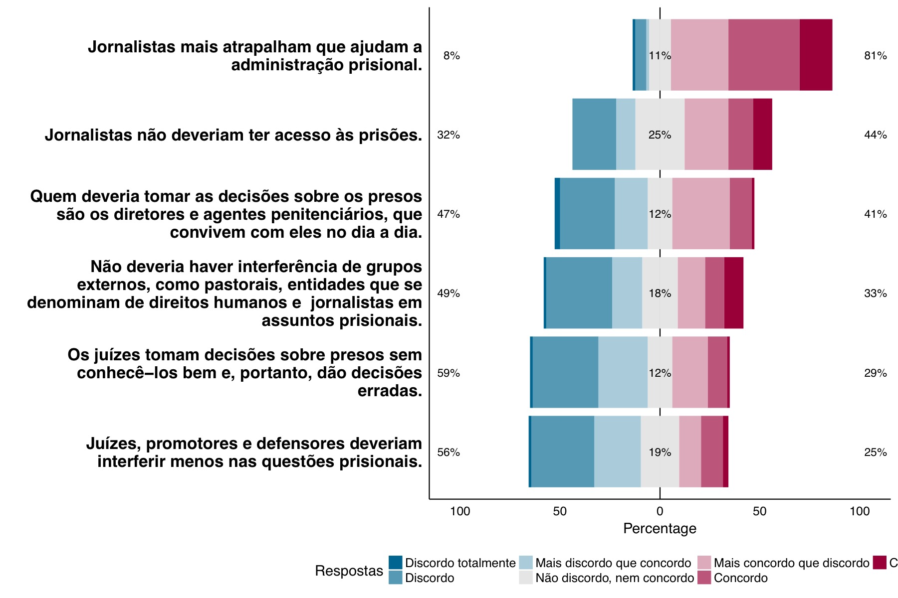
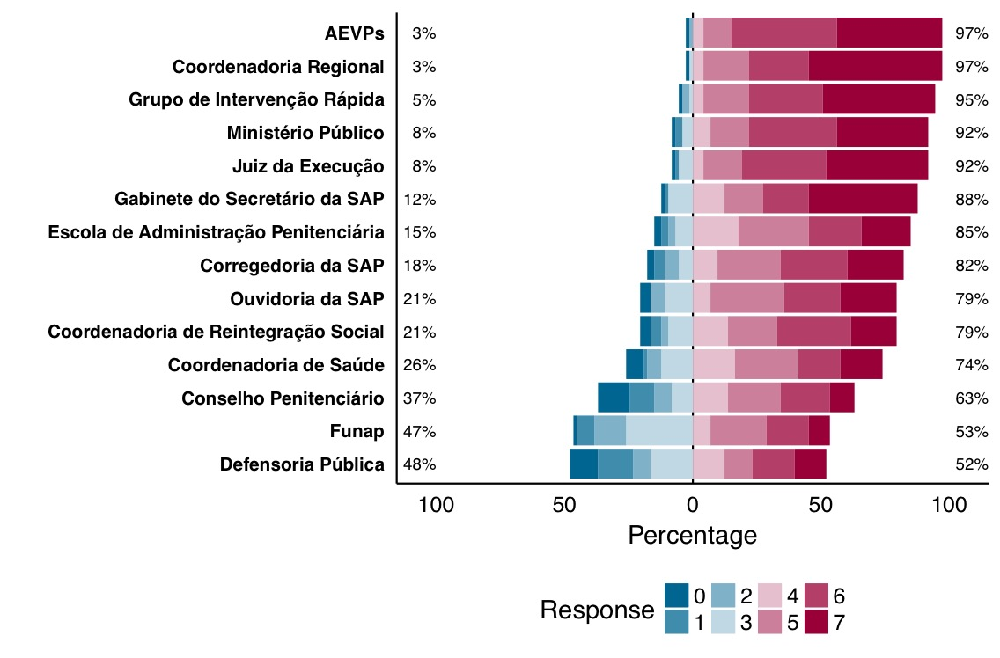
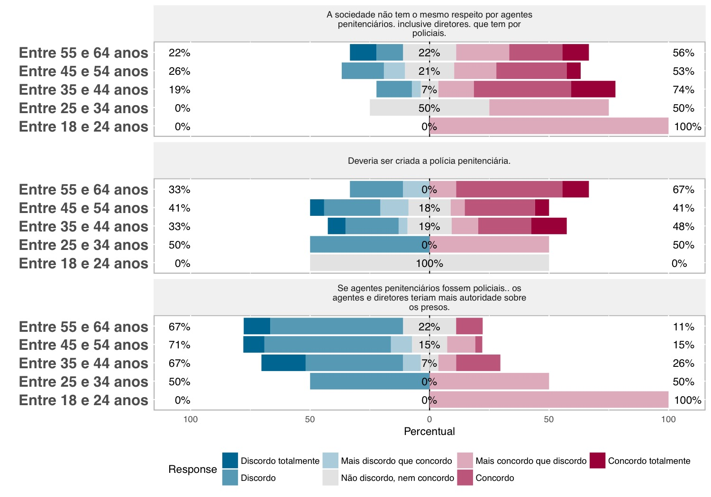

layout: true

background-image: url(https://github.com/jjesusfilho/heloisa/blob/master/Apresentacao/back.png?raw=true)


```{r setup, include=FALSE}
options(htmltools.dir.version = FALSE)
```

---
class:   middle, center

# Tese

A tese dedicou-se a analisar o controle sobre a população carcerária do estado de São Paulo à luz da atuação dos diretores das unidades prisionais frente a interveniência de outros atores, tais como o Judiciário e as facções.

Defende-se que houve processo de fragmentação do exercício de poder sobre a população carcerária, operado pelas transformações sociais e institucionais, as quais impuseram tensões e acomodações das forças em disputa. Algumas dessas forças podem ser mais facilmente identificadas: administração penitenciária central, diretor, diretor de segurança, facções, juiz da execução, defensor público e mídia.

---
class:   middle, center

# Achados

Ao pesquisar a atuação dos diversos atores, a pesquisa nos levou a relacioná-la ao perfil de cada um: presos e agentes penitenciários partilham de uma origem comum: são pobres e provenientes da periferia. Juízes e promotores são majoritariamente brancos do sexo masculino, provenientes das classes altas e média. Essas diferenças têm impacto significativo na forma como esses atores interagem entre si, como se verá ao longo dos capítulos.

---
class:   middle, center

# Perspectiva teórica

Enquanto teoria geral, nossa perspectiva teórica é de que houve um processo de centrifugação e multilateralização do exercício do controle punitivo ao longo dos anos, cujas concepções weberiana de Estado como detentor do monopólio do uso da força e o panoticismo, tal qual descrito por Foucault, se mostram insuficientes para explicar o controle no âmbito carcerária. 

Houve, ao nosso ver, um processo de fragmentação do exercício de poder sobre a população carcerária, operado pelas transformações sociais e institucionais, as quais impuseram tensões e acomodações das forças em disputa. Algumas dessas forças podem ser mais facilmente identificadas: administração penitenciária central, diretor, diretor de segurança, facções, juiz da execução, defensor público e mídia.

Além disso, cada capítulo fundou-se em diferentes bases teóricas. O primeiro capítulo baseou-se nas teorias do controle sobre a população carcerária, desde Sykes até o presente. O segundo capítulo baseou-se no debate sobre formalismo versus realismo jurídico. O terceiro capítulo baseou-se nas teses que explicam variações nas taxas de encarceramento. O quarto capítulo assumiu uma perspectiva histórica.

---
class:   middle, center

# Metodologia

Cada capítulo utilizou uma metodologia distinta.

- O primeiro capítulo aplicou análise fatorial sobre as respostas dos diretores a um questionário. Buscou-se identificar as propensões político-criminais dos diretores em temas como punitivismo a partir de indicadores mensurados por meio de ítens likert.

- O segundo capítulo utilizou de várias técnicas: raspagem de dados, mineração de texto, manipulação de dados e modelagem preditiva.

- O terceiro capítulo baseou-se em extensa pesquisa bibliográfica sobre os fatores que determinam o encarceramento e procedeu-se à análise das taxas de encarceramento por meio da aplicação de regressão com dados em painel.

- O quarto capítulo utilizou as técnicas de interpretação de normas comuns ao direito.

---
### Capítulo 1: Diretores prisionais e sua percepção sobre o sistema carcerário

Buscou-se identificar a capacidade dos diretores de gerir as unidades prisionais, especialmente no que concerne ao controle da população carcerária, frente a atuação de diversos outros atores que, legal ou extralegalmente, exercem poder sobre a população carcerária.

Há basicamente três abordagens sobre o controle da população carcerária:


1.  Reconhecimento dos presos como coparticipantes na gestão;<sup>1</sup>


2.  Centralidade da figura do gestor e controle baseado na estrita disciplina;<sup>2</sup>


3.  Controle pelo gestor, mas gestão centrada na primazia dos direitos dos presos.<sup>3</sup>

.footnote[
[1] Posição defendida por Greshan Sykes, John Irwin e Richard Cloward.

[2] Posição defendida por John DiIulio, Bert Useem e James Wilson.

[3] Posição defendida por Andrew Coyle.
]

---
### Capítulo 1: Diretores prisionais e sua percepção sobre o sistema carcerário

Além do exercício do controle, outros aspectos foram considerados:

1. Orientação dos diretores em relação a presos, proximidade, e agentes penitenciários;

2. Orientação político-criminal: retribuição, ressocialização, intimidação, incapacitação para o crime, manutenção da ordem;

3. Opinião sobre ser policial, sua formação e autonomia.

---
### Capítulo 1: Diretores prisionais e sua percepção sobre o sistema carcerário

#### Qual desses objetivos você considera mais importantes para a administração prisional?


```{r out.width = "600px", message=F,echo=F}
knitr::include_graphics("l_objetivos.pdf")
```


---

---
### Capítulo 1: Diretores prisionais e sua percepção sobre o sistema carcerário

#### Percepção dos diretores em relação a agentes externos



---
### Capítulo 1: Diretores prisionais e sua percepção sobre o sistema carcerário
#### Como você classificaria o desempenho dos seguintes órgãos ou grupos?

```{r out.width = "700px", message=F,echo=F}

```

---
### Capítulo 1: Diretores prisionais e sua percepção sobre o sistema carcerário
#### Percepção sobre a posição do agente como policial em relação à idade dos diretores

```{r out.width = "600px", message=F,echo=F}

```

---
### Capítulo 1: Diretores prisionais e sua percepção sobre o sistema carcerário
```{r out.height="450px", message=F,echo=F}
knitr::include_graphics("graficoSEM.pdf")
```


